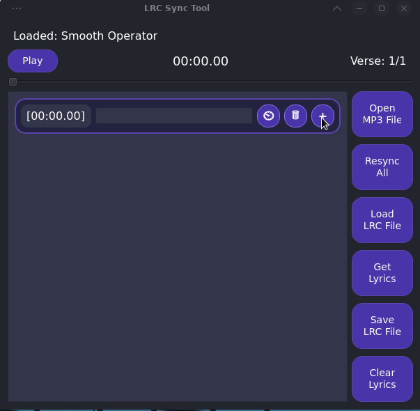
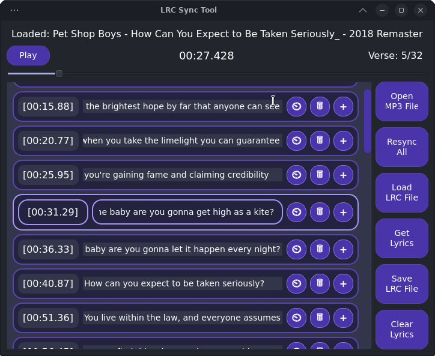

# LRC Sync Creator Tool

LRC Sync Tool is a powerful application for synchronizing audio files with their lyrics, designed to assist in creating LRC files by visually managing and syncing lyrics to audio files in real-time. 

---

## Features

1. **Audio Playback**: Load and play `.mp3` files with basic media controls, including a seek bar.
2. **Lyric Synchronization**: Sync lyrics with audio by adding, adjusting, and editing timestamps.
3. **Verse Management**: Clear, add, delete, or resync verses within the lyric display.
4. **Keyboard Shortcuts**:
    - **Space**: Toggle play/pause.
    - **"N" Key**: Quickly sync the next verse.
5. **Online Lyrics Fetching**: Search for and import lyrics online.
6. **File Operations**:
    - Load LRC files with synchronized timestamps.
    - Save custom-synced LRC files.

---

## Installation
Clone this repository, download it or get the `lrcSync.py` in some way.  
For the required libraries:
```bash
pip install PyQt6 syncedlyrics
```
You will also need to have QT installed.
---

## Usage

### Starting the App
1. Run the app with `python lrcSync.py`.
2. Click "Open MP3 File" to load an audio file.

### Syncing Lyrics
1. Use "Get Lyrics" to fetch lyrics online or "Load LRC File" to import an existing file.
2. Use "Resync All" for batch resynchronization, or click the ⏲ button next to each line for individual synchronization.

---

## User Interface



---

## Roadmap
- Add "click to select"
- Visual Changes to the interface
- Add real-time current lyric under the player

## License

MIT License.
